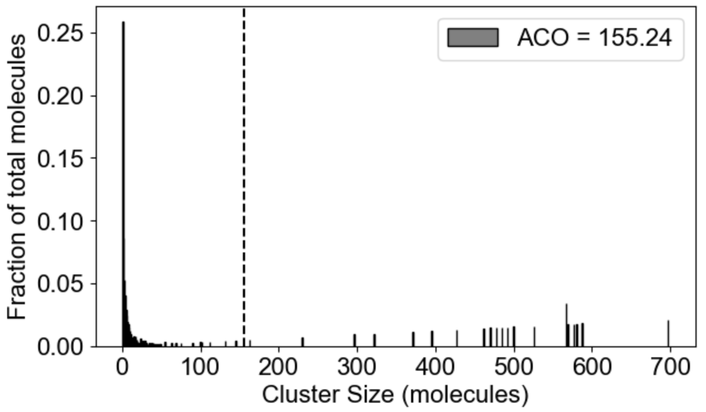

# MolClustPy

## Python package to analyze composition of multivalent biomolecular clusters 

Interactions among multi-valent molecules are known to result in polymeric structures - large molecular clusters consisting of hundreds to thousands of connected molecules. When the affinities of the individual molecular interactions are relatively weak, multivalent clusters maintain their integrity but allow various molecular compositions (Mayer et al, 2009), so multiple simulation runs are required to determine the average behavior of such bimolecular system. <b>MolClustPy</b> is a Python package to perform multiple stochastic simulation runs using NFSim (Network-Free stochastic simulator, ) and characterize distribution of cluster sizes, molecular composition, and bonds across molecular clusters and individual molecules of different types. 

## Input: rule-based model specification in BioNetGen Language (BNGL) format

Such systems require a special kind of modeling technique called Rule based modeling (RBM) (Blinov et al., 2004). In this approach, a molecule is modelled as an object with multiple sites.  

<table>
  <tr>
    <td></td>
    <td>  <tt>
Nck(SH2,s1,s2,s3)<br>
Nephrin(Y1,Y2,Y3)<br>
NWasp(p1,p2,p3,p4,p5,p6)
      </tt></td>
  </tr>
 </table>

Here on the left we show visaulization of molecules in VCell notations (Blinov et al., 2016): Nck has 4 binding sites - one SH2 and three SH3 (called s1, s2, s3); Nephrin has three tyrosine binfing sites Y1, Y2 and Y3; and N-Wasp has 6 PRM binding sites coded p1, p2, ..p6. On the right we show how these molecules are defined in BNGL notations.


A set of rules then specifies the interactions among molecules.
<table>
  <tr>
    <td></td>
    <td></td>
  </tr>
 </table>

Here we show two example of rules: on the left is binding of Nck to NWasp via interaction of s1 site with p1. On the right is binding of Nephrin to Nck via interaction of Y1 site of Nephrin with SH2 domain of Nck. The full set of rules consists of 18 rules of the first type (6x3) and 3 rules of the second type (1x3). Below are the same rules written in BNGL notations. kon and koff are on and off rate constants for mass-action kinetic law - default kinetic law in BioNetGen.
```code
Nck(s1) + NWASP(p1) <-> Nck(S1!1).NWASP(p1!1)		        kon_23, koff_23
Nephrin(pY1) + Nck(Sh2) <-> Nephrin(pY1!1).Nck(Sh2!1)		kon_12, koff_12
```

Finally, the essential part of model specification is the observables - the pattern that specify properties of molecular complexes we'd like to track. Below are three observables - free Nephrin (no site is bound), fully bound Nephrin (all sites are bound), and a comples of Nick and NWasp with undefined connectivity. Underneath are the same observables written in BNGL notations.

<table>
  <tr>
    <td></td>
    <td></td>
    <td></td>
  </tr>
 </table>
 ```code
Molecules free_Nephrin Nephrin(pY1,pY2,pY3)
Molecules fully_bound_Nephrin Nephrin(pY1!+,pY2!+,pY3!+)
Molecules cluster_nck_nw Nck().NWASP()
```

The results of a single NFSim simulation are 1) timecourses for all observables; and (2) the file with the final set of molecular complexes. Below is a snapshot of a rather small molecular cluster and the neginning of BNGL string describing it:


 ```code
NWASP(p1!1,p2,p3,p4,p5!2,p6!3).Nck(S1!1,S2,S3!4,Sh2).Nck(S1!2,S2!5,S3,Sh2)...
```

## Output: statistical characterization of molecular clusters composition

MolClustPy is a Python package that can be run as a command line or as a Jupyter notebook. It simulates the BNGL file several (user-defined) number of times and outputs visualization of simulation results. Below the model specified in './test_dataset/Nephrin_Nck_NWASP_high_concentration.bngl' file is simulated <b>numRuns</b> times for 0.4 seconds (<b>t_end*steps</b>).


The package will analyze multiple runs and display envelope (min-max) for timecourses of observables:
<table>
  <tr>
    <td></td>
    <td></td>
  </tr>
 </table>
 
### Global properties of clusters
  
MolClustPy will analyze and plot average occupancy (fraction of total molecules in clusters of different sizes, and the the average cluster size among all clusters weighted by number of molecules), as well as binning of clusters by size: here we see the fraction of molecules in small (1-10 molecules), medium (10-100 molecules) and large (more than 100 molecules) clusters.
<table>
  <tr>
    <td></td>
    <td></td>
  </tr>
 </table>

MolClustPy will analyze and plot the frequency of molecules in clusters with a given number of bonds. On the left is a plot indicating that almost 48% of all molecules have very weak connectivity (one bond), while there are few molecules that serve as hubs with 3, 4, 5 or even 6 (there are NWasp molecules) bonds. An average molecule has 1.75 bonds. On the right the same cluster distribution is plotted as bound fraction of molecules per cluster size. One can see that large clusters tend to be unique (red dots) while small clusters come in a variety of compositions. What is more important, the bound fraction converges to a fixed value for larger clusters, meansing binding sites are saturated up to 42% maximum.
<table>
  <tr>
    <td></td>
    <td></td>
  </tr>
 </table>
 
### Molecule-specific properties of clusters
  
 Apart from the cluster size distribution, it might be useful to know the composition of the clusters with respect to individual molecular types. On the left we plot the relative fraction of each molecular type within a given cluster size. Note that the sum of all fractions for a given molecular types should be equal to one. For large cluster size range, it might be of interest to inspect composition of a list of special clusters - either of specific sizes (2,4,10 - middle plot), or within the range (580-587, right plot).
 
 <table>
  <tr>
    <td></td>
    <td></td>
    <td></td>
  </tr>
 </table>

Finally, MolClustPy can plot bonds distribution for a specific molecular type, e.g. fraction of molecules Nck with a given number of bonds (which can go up to 4 at most):
<table>
  <tr>
    <td></td>
  </tr>
 </table>

### Text data for individual processing
 
All the simulation outputs of NFSim is written to the folder with the same name as the BNGL file. The statistical data generated by MolClustPy and used to plot figures is stored in pyStat folder within the model folder.
