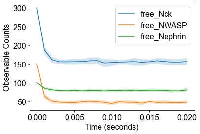
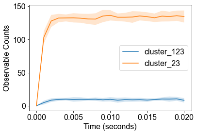
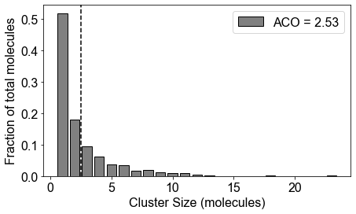
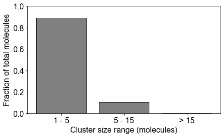
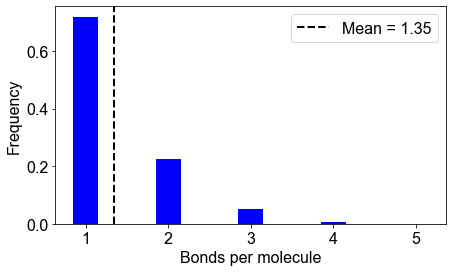
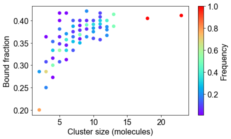
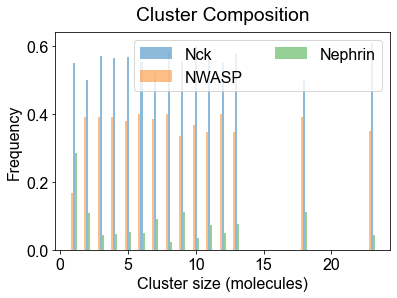
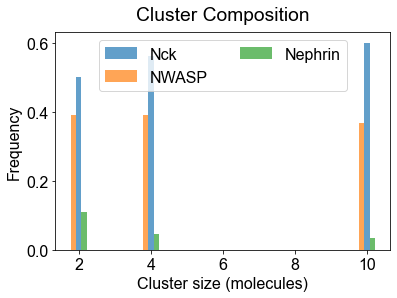
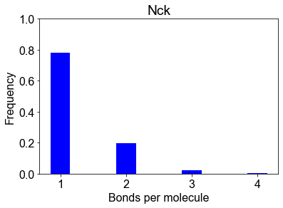

# MolClustPy Package Usage

How to install

    pip install MolClustPy

In case you get the following error while using the package 

AttributeError: module bionetgen has no attribute 'bngmodel

simply do pip uninstall bionetgen, and then pip install bionetgen


```python
from MolClustPy import * 
```


```python
# Location of bngl file in your local machine
bng_file = '/Users/indynalagandla/Downloads/nfsimPy_11Nov/test_dataset/single_concentration_file/neph_nck_nwasp_10_30_15uM.bngl'
```


```python
# Initialization of the Simulation Object
simObj = BNG_multiTrials(bng_file, t_end=0.02, steps=20, numRuns=20)
print(simObj)
simObj.runTrials(delSim=False)
print()
```

    
    ***** // ***** 
    Class : BNG_multiTrials
    File Path : /Users/indynalagandla/Downloads/nfsimPy_11Nov/test_dataset/single_concentration_file/neph_nck_nwasp_10_30_15uM.bngl
    
    t_end : 0.02 seconds 	 output_steps : 20
    Number of runs: 20
    
    Molecules: ['NWASP', 'Nck', 'Nephrin']
    Number of binding sites: [6, 4, 3]
    Species Counts: [100.0, 300.0, 150.0]
    
    NFsim progress : [****************************************] 100%
    Execution time : 6.8216 seconds
    


```python
# analyze data across multiple trials
outpath = simObj.getOutPath()
molecules, numSite, counts, _ = simObj.getMolecules()
nfsObj = NFSim_output_analyzer(outpath)
print(nfsObj)
nfsObj.process_gdatfiles()
nfsObj.process_speciesfiles(molecules, counts, numSite)
```

    
    ***** // ***** 
    Class : NFSim_output_analyzer
    System : neph_nck_nwasp_10_30_15uM
    Total Trajectories : 20
    
    Processing gdat_files : [****************************************] 100%
    
    Observables:  {0: 'time', 1: 'tot_Nck', 2: 'free_Nck', 3: 'tot_NWASP', 4: 'free_NWASP', 5: 'tot_Nephrin', 6: 'free_Nephrin', 7: 'cluster_123', 8: 'cluster_23'}
    
    Processing species_files : [****************************************] 100%


```python
# indexList for observables
plotTimeCourse(outpath, obsList=[2,4,6])
plotTimeCourse(outpath, obsList=[7,8])
```


    

    


    

    


```python
# 2A: Cluster size distribution (ACO: Average Cluster Occupancy)
plotClusterDist(outpath)
# Binned distribution by providing cluster size ranges
plotClusterDist(outpath, sizeRange=[1,5,15])
```


    

    


    

    


```python
# 2B: Number of bonds per molecule
plotBondsPerMolecule(outpath)
```


    

    


```python
# 2C: Bound fraction distribution
plotBoundFraction(outpath)
```


    

    


```python
# 3A. Average composition of indivual clusters. 
# Default is all the clusters present in the system. As before, adjust width and transparency (alpha) for visual clarity.
plotClusterComposition(outpath, specialClusters=[], width=0.15, alpha=0.5)
```


    

    


```python
# You can look at the composition of a set of clusters (specialClusters) also
plotClusterComposition(outpath, specialClusters=[2, 4, 10], width=0.15, alpha=0.7)

```


    

    


```python
# 3B. Bondcount distribution of each molecular type 
# plotBondCounts(outpath, molecules=molecules) # Reading molecules from previous block
# You may provide a subset of molecules also
plotBondCounts(outpath, molecules=['Nck'])
```


    

    


```python

```
