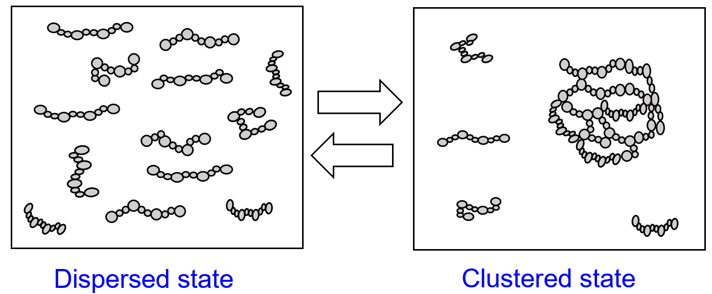
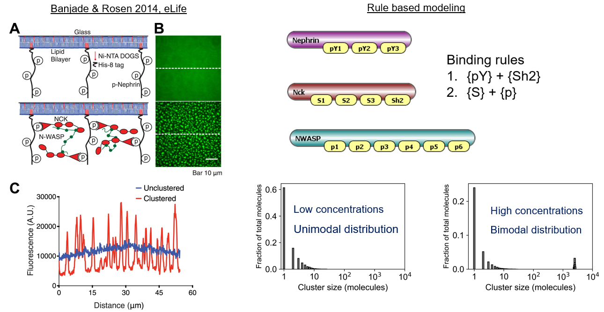

# MolClustPy: Biophysical Motivation

[Biomolecular condensates](https://www.ncbi.nlm.nih.gov/pmc/articles/PMC7434221/) are membrane-less sub-cellular compartments that play an important role in spatiotemporal regulation of cellular biochemistry. Clustering of weakly interacting multivalent biomolecules (proteins and nucleic acids) leads to condensate formation via phase transition ( [Li 2012](https://www.ncbi.nlm.nih.gov/pmc/articles/PMC3343696/), [Hyman 2014](https://www.annualreviews.org/doi/full/10.1146/annurev-cellbio-100913-013325), [Choi 2020](https://www.annualreviews.org/doi/full/10.1146/annurev-biophys-121219-081629)). Dysregulation of condensate biology is implicated in a series of pathological conditions ([Alberti 2019](https://www.annualreviews.org/doi/10.1146/annurev-genet-112618-043527?url_ver=Z39.88-2003&rfr_id=ori%3Arid%3Acrossref.org&rfr_dat=cr_pub++0pubmed), [Mathieu 2020](https://pubmed.ncbi.nlm.nih.gov/33004511/), [Wang 2021](https://www.nature.com/articles/s41392-021-00678-1)).

Since clustering of multivalent biomolecules underlies the condensate formation, characterizing the physical properties of these clusters has become a major aspect in recent biophysical research. For example, size and composition of the condensates have important consequences in cell signaling ([Su 2016](https://pubmed.ncbi.nlm.nih.gov/27056844/), [Case 2019](https://pubmed.ncbi.nlm.nih.gov/30846599/)). 

Molecular clustering shows a switch-like behavior ([phase transition](https://www.ncbi.nlm.nih.gov/pmc/articles/PMC3343696/)) in a concentration dependent manner ( [Chattaraj 2021](https://elifesciences.org/articles/67176), [Chattaraj 2023](https://www.biorxiv.org/content/10.1101/2022.10.04.510809v1)). Below a threshold concentration, molecules remain in monomeric and small oligomeric state (left panel, dispersed state) that will manifest as a single homogeneous phase. Upon crossing the threshold, system tends to form really large clusters (right panel, condensed state). The co-existence of large clusters along with small clusters result in a spliting of the system into two distinct phases (dense and dilute). The dense phase (large clusters) assumes the role of the condensate in different biological contexts. Also, the phase transition can be reversed by changing the post-translational modification state. Thus studying these clustering processes provide crucial mechanistic understanding of cell biology.

One well-characterized multivalent system is Nephrin, Nck and NWASP ([Li 2012](https://www.ncbi.nlm.nih.gov/pmc/articles/PMC3343696/), [Banjade 2014](https://elifesciences.org/articles/04123)), which undergoes phase transition (see below, left panel) both in-vitro and in-vivo. 
We have [adapted](/../index.md) this three-component system (see below, right panel) to demonstrate the essential aspects of biomolecular clustering. Using MolClustPy, we can quantify the cluster size distributions at two different concentrations. We can see a heavily bifurcated cluster distribution at high concentration, while the lower concentration yields an exponetially decaying distribution containing mostly monomers and small clusters. This bifurcated cluster distribution would appear as a phase separated state at macroscopic scale. Clustering of such three-component system (inspired by Nephrin-Nck-NWASP example) is studied [here](https://elifesciences.org/articles/67176). 

