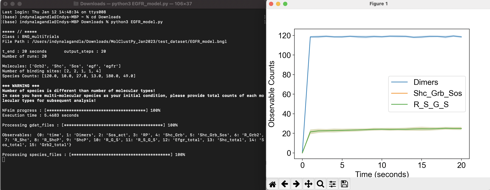
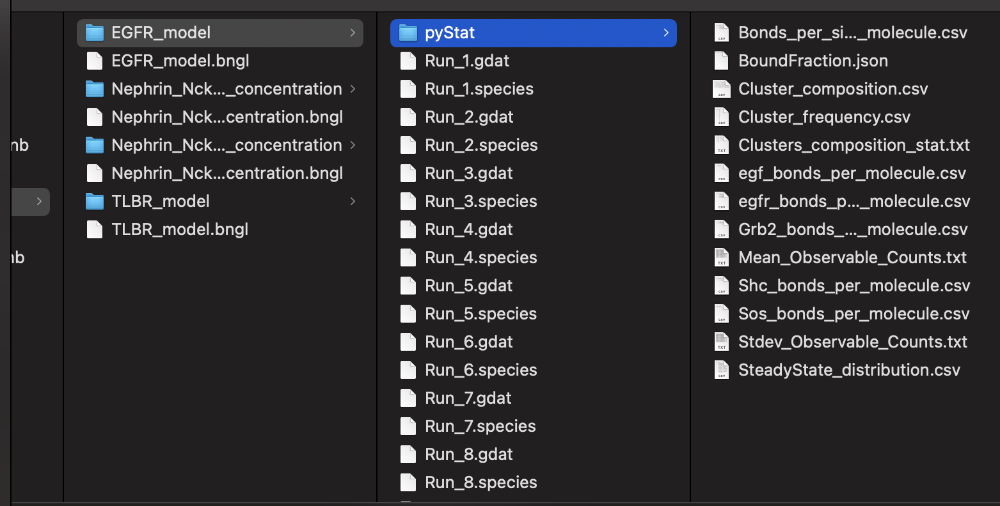

# Quickstart Guide for the Command Line
 
### Install Python
- Download and install [Anaconda Distribution](https://www.anaconda.com/products/distribution) for Python

### Pip Install Package

Open terminal and type:

```python
pip install MolClustPy
```

### Download .py File

Downloadable .py files that can be ran in Python: 
- [Nephrin_Nck_NWASP_high_concentration.py](../assets/test_datasets/Nephrin_Nck_NWASP_high_concentration.py)
- [EGFR_model.py](../assets/test_datasets/EGFR_model.py)
- [TLBR_model.py](../assets/test_datasets/TLBR_model.py) 

Downloadable .bngl files that correlate with the above .py files:
- [Nephrin_Nck_NWASP_high_concentration.bngl](../assets/test_datasets/Nephrin_Nck_NWASP_high_concentration.bngl)
- [EGFR_model.bngl](../assets/test_datasets/EGFR_model.bngl)
- [TLBR_model.bngl](../assets/test_datasets/TLBR_model.bngl) 

Once the .bngl file is downloaded, identify its location/path

### Modifying the .py File

This section will get you started on understanding and making changes to the code.
For greater detail, visit the [How to Use](usage.md) page.

Import package and set bngl file path

```python
from MolClustPy import *

# bngl file (BioNetGen model) 
bng_file = 'place the path to your local .bngl file here'
```

Specify the simulation details
- duration of each simulation (t_end)
- number of output points (steps)
- number of stochastic trials (numRuns) 

```python
# run multiple trials
simObj = BNG_multiTrials(bng_file, t_end=20, steps=20, numRuns=20)
print(simObj)
simObj.runTrials(delSim=False)
print()
```

NFsim_output_analyzer collects the observables and molecular clusters to perform various statistical analysis:
- Ensemble average of the observables (Enlist the observables in order to visualize in later section)

Biophysical characterization of the molecular clusters (size distribution, composition, degree of saturation and cross-linking). In order to do these calculations, the function ( process_speciesfiles ) expects the following arguments
-  Name of the molecules ( molecules )
-  Number of molecules ( counts )
-  Valency or number of binding sites of each molecular type ( numSite )

These details are automatically filled in by parsing the input file.

Note: If the model contains multi-molecular species as initial conditions, then the user needs to provide the initial counts manually.

```python
# analyze data across multiple trials
outpath = simObj.getOutPath()
molecules, numSite, counts, _ = simObj.getMolecules()
nfsObj = NFSim_output_analyzer(outpath)
nfsObj.process_gdatfiles()
#nfsObj.process_speciesfiles(molecules, counts=counts, valency=numSite) # will give an error
nfsObj.process_speciesfiles(molecules, counts=[59,27,62,120,180], valency=numSite)
```
Plot Observable Time Course

- A list of observables can be passed by the indexList (as printed earlier)
- If nothing is passed, all the observables will be plotted
- The dark line denotes the mean trajectory and the fluctuation envelop displays the standard deviation at that point

```python
plotTimeCourse(outpath, obsList=[1,5,11])
```
Cluster size distribution :
- Fraction of total molecules vs cluster size. Mean of the distribution is called average cluster occupancy (ACO) as shown by the dashed line. This is a probability distribution which suggests that the probability of finding a molecule in a cluster size 2 is 17% if the corresponding fraction is 0.17
- For a large cluster size range, a binned histogram might be helpful. If a system forms clusters from 10 molecules to 1000 molecules, then one might inspect the distribution at certain size ranges like sizeRange = [1,10,100,1000]

```python
# 2A: Cluster size distribution (ACO: Average Cluster Occupancy)
plotClusterDist(outpath)
# You can plot a binned distribution by providing cluster size ranges
plotClusterDist(outpath, sizeRange=[1,10])
```
Average degree of cross-linking. Number of bonds coming out of individual molecules at steady state.

```python
# 2B: Number of bonds per molecule
plotBondsPerMolecule(outpath)
```
For each cluster, bound fractions (bound sites / total sites) and their relative frequencies are plotted. This shows the extent of binding site saturation within a given cluster size. Bound fraction converges to a fixed value for larger clusters for entropic reason.

```python
# 2C: Bond fraction distribution
plotBoundFraction(outpath)
```
Apart from the cluster size distribution, it might be useful to know the composition of the clusters.
- Relative fraction of each molecular type within a given cluster size. The summation of fractions is 1 for each cluster.
- For large cluster size range, it might be of interest to inspect composition of a list of special clusters

Width sets the thickness of the bars and alpha sets the transparency.

```python
# 3A. Average composition of indivual clusters. 
# Default is all the clusters present in the system. As before, adjust width and transparency (alpha) for visual clarity.
plotClusterComposition(outpath, specialClusters=[], width=0.15, alpha=0.5)

# You can look at the composition of a set of clusters (specialClusters) also
plotClusterComposition(outpath, specialClusters=[4, 6, 7], width=0.15, alpha=0.5)

# 3B. Bondcount distribution of each molecular type 
# You may provide a subset of molecules also
plotBondCounts(outpath, molecules=['egfr'])
```


### Running .py File

Open Command Line and in the same directory as the .py file, type:

```python
python file_name.py
```
or

```python
python3 file_name.py
```

### Command Prompt Output and Results

The terminal will ouput this: 



The outputed results will be found in the same location as the bngl file:



Simulation output will be stored in a folder called MyModel if the model name is MyModel.bngl. There are two types of output:
- gdat files (Run_1.gdat, Run_2.gdat, ... , Run_N.gdat) containing the timeseries of observables
- species files (Run_1.species, Run_2.species, ... , Run_N.species) containing the molecular species (clusters)

Note: If the folder already contains results and number of current trials is less than existing ones, then existing results will be deleted. For higher number of trials, existing trajectories will be overwritten.


### Locating Package Through Command Line

If you need to find the location of the package
- open terminal
- open python and type

```python
import MolClustPy
print(MolClustPy.__file__)
```
This will output a path to the package that will look something like this

```python
/usr/local/lib/python3.10/site-packages/MolClustPy/__init__.py
```

### Summary
- Download and install [Anaconda Distribution](https://www.anaconda.com/products/distribution) for Python
- Download .py and .bngl file from the link provided above
- Type ```python file_name.py``` or ``` python3 file_name.py``` to run file
- Outputs can be found in the same location as bngl file
- Check Above or [How to Use](usage.md) for modifying code

<b> You can check [MolClustPy Jupyter Notebook DEMO](MolClustPy_Usage/MolClustPy_Usage.md) for an example of how the package is used. </b>

### Common Error Identification
- An error can occur involving Bionetgen due to version control issues when running the package so it is best to pip uninstall bionetgen then pip install bionetgen in order to prevent the error from occuring.

AttributeError: module 'bionetgen' has no attribute 'bngmodel'
