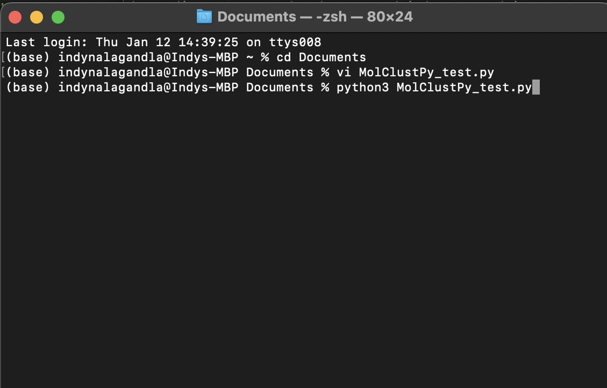

# Quickstart Guide for the MolClustPy Python package

This package contains all the code and functionality of the MolClustPy in a package

### The first step is to install the MolClustPy package

You can use this command in the Terminal to install the latest version of the package onto your device:

```python
pip install MolClustPy
```

The package will be installed into your device in the site-packages area

The package contains:
- three primarily used .py files: MultiRun_BNG.py, NFsim_data_analyzer.py, and DataViz_Nfsim.py. These are the files that will be imported into your code when you are using the package. Each of the files contains the functions that make up the MolClustPy package. The package contains other .py files to supplement these files.

Example .py files that can be ran in Python: 
- [Nephrin_Nck_NWASP_high_concentration.py](../assets/test_datasets/Nephrin_Nck_NWASP_high_concentration.py)
- [EGFR_model.py](../assets/test_datasets/EGFR_model.py)
- [TLBR_model.py](../assets/test_datasets/TLBR_model.py) 
 

Here is an example pathway of the location of the package:

```python
/Users/name/opt/anaconda3/lib/python3.9/site-packages/MolClustPy
```

### Using the MolClustPy Package

Using the package is the same as using the code downloaded through the other methods(zip or github clone) but you will need to make a few changes.

The main difference will be in the imports:

Instead of doing this:
```python
from NFsim_data_analyzer import *
from DataViz_NFsim import * 
from MultiRun_BNG import * 
```

You should do this:
```python
from MolClustPy import *
```

You will also have to assign a bngl file of your own and its path when coding.
```python  
    # bngl file (BioNetGen model) 
    bng_file = '/Users/name/Downloads/nfsimPy/test_dataset/single_concentration_file/neph_nck_nwasp_10_30_15uM.bngl'
```
You can follow the tutorial given at [How to use](usage.md) page and make these changes as you go.
It will provide step-by-step guide to modifying inputs and analyzing outputs of cluster formation while using the package. 

<b> You can check [MolClustPy Jupyter Notebook DEMO](MolClustPy_Usage/MolClustPy_Usage.md) for an example of how the package is used. </b>
### Running Pip in Command Line

First choose and navigate to the directory that you want to house the files that you are working with. 


Then you will create or obtain a .py file and place it in this directory
.py files have been provided
To create a file you can go in the terminal and use the vi command to create a new file.


What to put in the .py file


Once you have created the Python file and filled it, open terminal and navigate to the directory that the file is housed in
Once you have navigated to the directory, type "python3 _name_.py" (_name_ is whatever you named your file) This will open and run the file.



### Common Error Identification
- An error can occur involving Bionetgen due to version control issues when running the package so it is best to pip uninstall bionetgen then pip install bionetgen in order to prevent the error from occuring.

AttributeError: module 'bionetgen' has no attribute 'bngmodel'
